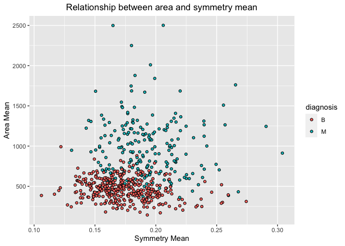
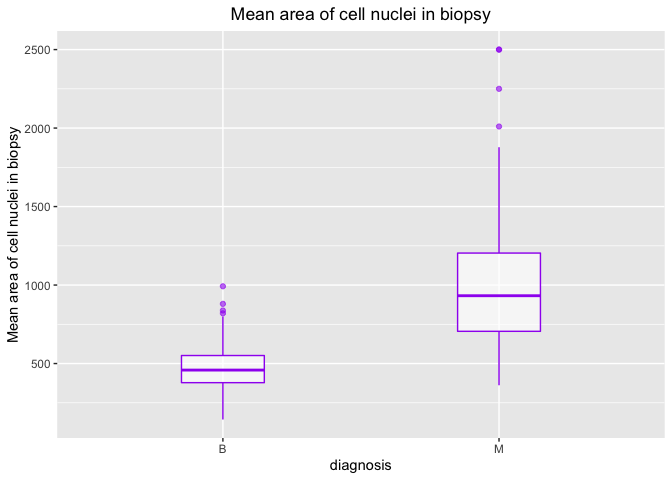
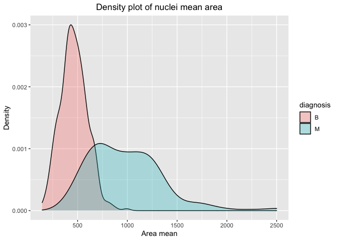
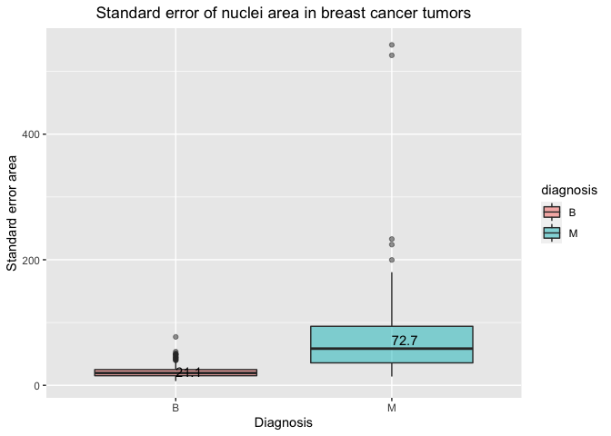
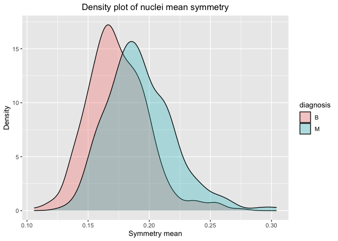
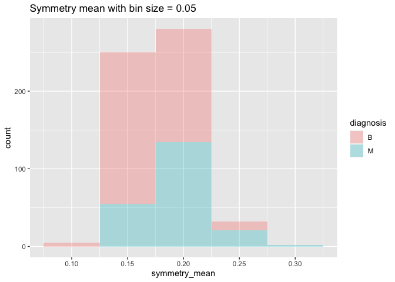
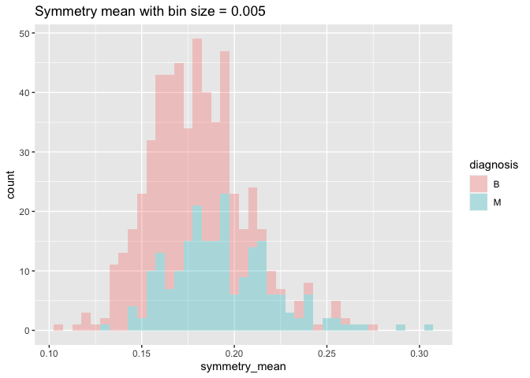
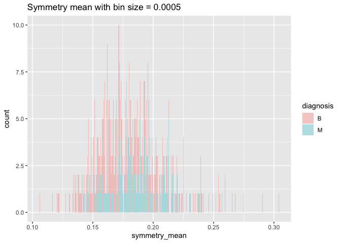
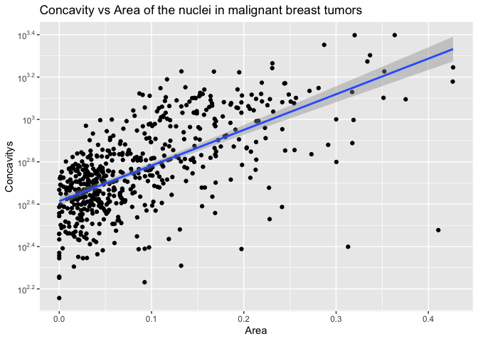

Mini Data-Analysis Deliverable 1
================

# Welcome to your (maybe) first-ever data analysis project!

And hopefully the first of many. Let’s get started:

1.  Install the [`datateachr`](https://github.com/UBC-MDS/datateachr)
    package by typing the following into your **R terminal**:

<!-- -->

    install.packages("devtools")
    devtools::install_github("UBC-MDS/datateachr")

2.  Load the packages below.

``` r
library(datateachr)
library(tidyverse)
```

    ## ── Attaching packages ─────────────────────────────────────── tidyverse 1.3.2 ──
    ## ✔ ggplot2 3.3.6      ✔ purrr   0.3.5 
    ## ✔ tibble  3.1.8      ✔ dplyr   1.0.10
    ## ✔ tidyr   1.2.1      ✔ stringr 1.4.1 
    ## ✔ readr   2.1.3      ✔ forcats 0.5.2 
    ## ── Conflicts ────────────────────────────────────────── tidyverse_conflicts() ──
    ## ✖ dplyr::filter() masks stats::filter()
    ## ✖ dplyr::lag()    masks stats::lag()

``` r
library(scales)
```

    ## 
    ## Attaching package: 'scales'
    ## 
    ## The following object is masked from 'package:purrr':
    ## 
    ##     discard
    ## 
    ## The following object is masked from 'package:readr':
    ## 
    ##     col_factor

``` r
library(broom)
```

3.  Make a repository in the <https://github.com/stat545ubc-2022>
    Organization. You will be working with this repository for the
    entire data analysis project. You can either make it public, or make
    it private and add the TA’s and Lucy as collaborators. A link to
    help you create a private repository is available on the
    #collaborative-project Slack channel.

# Instructions

## For Both Milestones

-   Each milestone is worth 45 points. The number of points allocated to
    each task will be annotated within each deliverable. Tasks that are
    more challenging will often be allocated more points.

-   10 points will be allocated to the reproducibility, cleanliness, and
    coherence of the overall analysis. While the two milestones will be
    submitted as independent deliverables, the analysis itself is a
    continuum - think of it as two chapters to a story. Each chapter, or
    in this case, portion of your analysis, should be easily followed
    through by someone unfamiliar with the content.
    [Here](https://swcarpentry.github.io/r-novice-inflammation/06-best-practices-R/)
    is a good resource for what constitutes “good code”. Learning good
    coding practices early in your career will save you hassle later on!

## For Milestone 1

**To complete this milestone**, edit [this very `.Rmd`
file](https://raw.githubusercontent.com/UBC-STAT/stat545.stat.ubc.ca/master/content/mini-project/mini-project-1.Rmd)
directly. Fill in the sections that are tagged with
`<!--- start your work below --->`.

**To submit this milestone**, make sure to knit this `.Rmd` file to an
`.md` file by changing the YAML output settings from
`output: html_document` to `output: github_document`. Commit and push
all of your work to the mini-analysis GitHub repository you made
earlier, and tag a release on GitHub. Then, submit a link to your tagged
release on canvas.

**Points**: This milestone is worth 45 points: 43 for your analysis, 1
point for having your Milestone 1 document knit error-free, and 1 point
for tagging your release on Github.

# Learning Objectives

By the end of this milestone, you should:

-   Become familiar with your dataset of choosing
-   Select 4 questions that you would like to answer with your data
-   Generate a reproducible and clear report using R Markdown
-   Become familiar with manipulating and summarizing your data in
    tibbles using `dplyr`, with a research question in mind.

# Task 1: Choose your favorite dataset (10 points)

The `datateachr` package by Hayley Boyce and Jordan Bourak currently
composed of 7 semi-tidy datasets for educational purposes. Here is a
brief description of each dataset:

-   *apt_buildings*: Acquired courtesy of The City of Toronto’s Open
    Data Portal. It currently has 3455 rows and 37 columns.

-   *building_permits*: Acquired courtesy of The City of Vancouver’s
    Open Data Portal. It currently has 20680 rows and 14 columns.

-   *cancer_sample*: Acquired courtesy of UCI Machine Learning
    Repository. It currently has 569 rows and 32 columns.

-   *flow_sample*: Acquired courtesy of The Government of Canada’s
    Historical Hydrometric Database. It currently has 218 rows and 7
    columns.

-   *parking_meters*: Acquired courtesy of The City of Vancouver’s Open
    Data Portal. It currently has 10032 rows and 22 columns.

-   *steam_games*: Acquired courtesy of Kaggle. It currently has 40833
    rows and 21 columns.

-   *vancouver_trees*: Acquired courtesy of The City of Vancouver’s Open
    Data Portal. It currently has 146611 rows and 20 columns.

**Things to keep in mind**

-   We hope that this project will serve as practice for carrying our
    your own *independent* data analysis. Remember to comment your code,
    be explicit about what you are doing, and write notes in this
    markdown document when you feel that context is required. As you
    advance in the project, prompts and hints to do this will be
    diminished - it’ll be up to you!

-   Before choosing a dataset, you should always keep in mind **your
    goal**, or in other ways, *what you wish to achieve with this data*.
    This mini data-analysis project focuses on *data wrangling*,
    *tidying*, and *visualization*. In short, it’s a way for you to get
    your feet wet with exploring data on your own.

And that is exactly the first thing that you will do!

1.1 Out of the 7 datasets available in the `datateachr` package, choose
**4** that appeal to you based on their description. Write your choices
below:

**Note**: We encourage you to use the ones in the `datateachr` package,
but if you have a dataset that you’d really like to use, you can include
it here. But, please check with a member of the teaching team to see
whether the dataset is of appropriate complexity. Also, include a
**brief** description of the dataset here to help the teaching team
understand your data.

<!-------------------------- Start your work below ---------------------------->

1: cancer_sample 2: vancouver trees 3: flows sample 4: steam games

<!----------------------------------------------------------------------------->

1.2 One way to narrowing down your selection is to *explore* the
datasets. Use your knowledge of dplyr to find out at least *3*
attributes about each of these datasets (an attribute is something such
as number of rows, variables, class type…). The goal here is to have an
idea of *what the data looks like*.

*Hint:* This is one of those times when you should think about the
cleanliness of your analysis. I added a single code chunk for you below,
but do you want to use more than one? Would you like to write more
comments outside of the code chunk?

<!-------------------------- Start your work below ---------------------------->

``` r
### EXPLORE HERE ###

#The following commands were used to explore the data sets chosen:
#class(): To investigate the class of the specified object
#glimpse(): Transposes columns to rows so you can see all the columns in the data set
#head(): returns the first rows of the data set
#summary(): overview of different columns, type and distribution
#tibble::view(): shows data in a separate R studio window

# Cancer sample exploration
class(cancer_sample)
```

    ## [1] "spec_tbl_df" "tbl_df"      "tbl"         "data.frame"

``` r
glimpse(cancer_sample)
```

    ## Rows: 569
    ## Columns: 32
    ## $ ID                      <dbl> 842302, 842517, 84300903, 84348301, 84358402, …
    ## $ diagnosis               <chr> "M", "M", "M", "M", "M", "M", "M", "M", "M", "…
    ## $ radius_mean             <dbl> 17.990, 20.570, 19.690, 11.420, 20.290, 12.450…
    ## $ texture_mean            <dbl> 10.38, 17.77, 21.25, 20.38, 14.34, 15.70, 19.9…
    ## $ perimeter_mean          <dbl> 122.80, 132.90, 130.00, 77.58, 135.10, 82.57, …
    ## $ area_mean               <dbl> 1001.0, 1326.0, 1203.0, 386.1, 1297.0, 477.1, …
    ## $ smoothness_mean         <dbl> 0.11840, 0.08474, 0.10960, 0.14250, 0.10030, 0…
    ## $ compactness_mean        <dbl> 0.27760, 0.07864, 0.15990, 0.28390, 0.13280, 0…
    ## $ concavity_mean          <dbl> 0.30010, 0.08690, 0.19740, 0.24140, 0.19800, 0…
    ## $ concave_points_mean     <dbl> 0.14710, 0.07017, 0.12790, 0.10520, 0.10430, 0…
    ## $ symmetry_mean           <dbl> 0.2419, 0.1812, 0.2069, 0.2597, 0.1809, 0.2087…
    ## $ fractal_dimension_mean  <dbl> 0.07871, 0.05667, 0.05999, 0.09744, 0.05883, 0…
    ## $ radius_se               <dbl> 1.0950, 0.5435, 0.7456, 0.4956, 0.7572, 0.3345…
    ## $ texture_se              <dbl> 0.9053, 0.7339, 0.7869, 1.1560, 0.7813, 0.8902…
    ## $ perimeter_se            <dbl> 8.589, 3.398, 4.585, 3.445, 5.438, 2.217, 3.18…
    ## $ area_se                 <dbl> 153.40, 74.08, 94.03, 27.23, 94.44, 27.19, 53.…
    ## $ smoothness_se           <dbl> 0.006399, 0.005225, 0.006150, 0.009110, 0.0114…
    ## $ compactness_se          <dbl> 0.049040, 0.013080, 0.040060, 0.074580, 0.0246…
    ## $ concavity_se            <dbl> 0.05373, 0.01860, 0.03832, 0.05661, 0.05688, 0…
    ## $ concave_points_se       <dbl> 0.015870, 0.013400, 0.020580, 0.018670, 0.0188…
    ## $ symmetry_se             <dbl> 0.03003, 0.01389, 0.02250, 0.05963, 0.01756, 0…
    ## $ fractal_dimension_se    <dbl> 0.006193, 0.003532, 0.004571, 0.009208, 0.0051…
    ## $ radius_worst            <dbl> 25.38, 24.99, 23.57, 14.91, 22.54, 15.47, 22.8…
    ## $ texture_worst           <dbl> 17.33, 23.41, 25.53, 26.50, 16.67, 23.75, 27.6…
    ## $ perimeter_worst         <dbl> 184.60, 158.80, 152.50, 98.87, 152.20, 103.40,…
    ## $ area_worst              <dbl> 2019.0, 1956.0, 1709.0, 567.7, 1575.0, 741.6, …
    ## $ smoothness_worst        <dbl> 0.1622, 0.1238, 0.1444, 0.2098, 0.1374, 0.1791…
    ## $ compactness_worst       <dbl> 0.6656, 0.1866, 0.4245, 0.8663, 0.2050, 0.5249…
    ## $ concavity_worst         <dbl> 0.71190, 0.24160, 0.45040, 0.68690, 0.40000, 0…
    ## $ concave_points_worst    <dbl> 0.26540, 0.18600, 0.24300, 0.25750, 0.16250, 0…
    ## $ symmetry_worst          <dbl> 0.4601, 0.2750, 0.3613, 0.6638, 0.2364, 0.3985…
    ## $ fractal_dimension_worst <dbl> 0.11890, 0.08902, 0.08758, 0.17300, 0.07678, 0…

``` r
head(cancer_sample)
```

    ## # A tibble: 6 × 32
    ##       ID diagn…¹ radiu…² textu…³ perim…⁴ area_…⁵ smoot…⁶ compa…⁷ conca…⁸ conca…⁹
    ##    <dbl> <chr>     <dbl>   <dbl>   <dbl>   <dbl>   <dbl>   <dbl>   <dbl>   <dbl>
    ## 1 8.42e5 M          18.0    10.4   123.    1001   0.118   0.278   0.300   0.147 
    ## 2 8.43e5 M          20.6    17.8   133.    1326   0.0847  0.0786  0.0869  0.0702
    ## 3 8.43e7 M          19.7    21.2   130     1203   0.110   0.160   0.197   0.128 
    ## 4 8.43e7 M          11.4    20.4    77.6    386.  0.142   0.284   0.241   0.105 
    ## 5 8.44e7 M          20.3    14.3   135.    1297   0.100   0.133   0.198   0.104 
    ## 6 8.44e5 M          12.4    15.7    82.6    477.  0.128   0.17    0.158   0.0809
    ## # … with 22 more variables: symmetry_mean <dbl>, fractal_dimension_mean <dbl>,
    ## #   radius_se <dbl>, texture_se <dbl>, perimeter_se <dbl>, area_se <dbl>,
    ## #   smoothness_se <dbl>, compactness_se <dbl>, concavity_se <dbl>,
    ## #   concave_points_se <dbl>, symmetry_se <dbl>, fractal_dimension_se <dbl>,
    ## #   radius_worst <dbl>, texture_worst <dbl>, perimeter_worst <dbl>,
    ## #   area_worst <dbl>, smoothness_worst <dbl>, compactness_worst <dbl>,
    ## #   concavity_worst <dbl>, concave_points_worst <dbl>, symmetry_worst <dbl>, …

``` r
summary(cancer_sample)
```

    ##        ID             diagnosis          radius_mean      texture_mean  
    ##  Min.   :     8670   Length:569         Min.   : 6.981   Min.   : 9.71  
    ##  1st Qu.:   869218   Class :character   1st Qu.:11.700   1st Qu.:16.17  
    ##  Median :   906024   Mode  :character   Median :13.370   Median :18.84  
    ##  Mean   : 30371831                      Mean   :14.127   Mean   :19.29  
    ##  3rd Qu.:  8813129                      3rd Qu.:15.780   3rd Qu.:21.80  
    ##  Max.   :911320502                      Max.   :28.110   Max.   :39.28  
    ##  perimeter_mean     area_mean      smoothness_mean   compactness_mean 
    ##  Min.   : 43.79   Min.   : 143.5   Min.   :0.05263   Min.   :0.01938  
    ##  1st Qu.: 75.17   1st Qu.: 420.3   1st Qu.:0.08637   1st Qu.:0.06492  
    ##  Median : 86.24   Median : 551.1   Median :0.09587   Median :0.09263  
    ##  Mean   : 91.97   Mean   : 654.9   Mean   :0.09636   Mean   :0.10434  
    ##  3rd Qu.:104.10   3rd Qu.: 782.7   3rd Qu.:0.10530   3rd Qu.:0.13040  
    ##  Max.   :188.50   Max.   :2501.0   Max.   :0.16340   Max.   :0.34540  
    ##  concavity_mean    concave_points_mean symmetry_mean    fractal_dimension_mean
    ##  Min.   :0.00000   Min.   :0.00000     Min.   :0.1060   Min.   :0.04996       
    ##  1st Qu.:0.02956   1st Qu.:0.02031     1st Qu.:0.1619   1st Qu.:0.05770       
    ##  Median :0.06154   Median :0.03350     Median :0.1792   Median :0.06154       
    ##  Mean   :0.08880   Mean   :0.04892     Mean   :0.1812   Mean   :0.06280       
    ##  3rd Qu.:0.13070   3rd Qu.:0.07400     3rd Qu.:0.1957   3rd Qu.:0.06612       
    ##  Max.   :0.42680   Max.   :0.20120     Max.   :0.3040   Max.   :0.09744       
    ##    radius_se        texture_se      perimeter_se       area_se       
    ##  Min.   :0.1115   Min.   :0.3602   Min.   : 0.757   Min.   :  6.802  
    ##  1st Qu.:0.2324   1st Qu.:0.8339   1st Qu.: 1.606   1st Qu.: 17.850  
    ##  Median :0.3242   Median :1.1080   Median : 2.287   Median : 24.530  
    ##  Mean   :0.4052   Mean   :1.2169   Mean   : 2.866   Mean   : 40.337  
    ##  3rd Qu.:0.4789   3rd Qu.:1.4740   3rd Qu.: 3.357   3rd Qu.: 45.190  
    ##  Max.   :2.8730   Max.   :4.8850   Max.   :21.980   Max.   :542.200  
    ##  smoothness_se      compactness_se      concavity_se     concave_points_se 
    ##  Min.   :0.001713   Min.   :0.002252   Min.   :0.00000   Min.   :0.000000  
    ##  1st Qu.:0.005169   1st Qu.:0.013080   1st Qu.:0.01509   1st Qu.:0.007638  
    ##  Median :0.006380   Median :0.020450   Median :0.02589   Median :0.010930  
    ##  Mean   :0.007041   Mean   :0.025478   Mean   :0.03189   Mean   :0.011796  
    ##  3rd Qu.:0.008146   3rd Qu.:0.032450   3rd Qu.:0.04205   3rd Qu.:0.014710  
    ##  Max.   :0.031130   Max.   :0.135400   Max.   :0.39600   Max.   :0.052790  
    ##   symmetry_se       fractal_dimension_se  radius_worst   texture_worst  
    ##  Min.   :0.007882   Min.   :0.0008948    Min.   : 7.93   Min.   :12.02  
    ##  1st Qu.:0.015160   1st Qu.:0.0022480    1st Qu.:13.01   1st Qu.:21.08  
    ##  Median :0.018730   Median :0.0031870    Median :14.97   Median :25.41  
    ##  Mean   :0.020542   Mean   :0.0037949    Mean   :16.27   Mean   :25.68  
    ##  3rd Qu.:0.023480   3rd Qu.:0.0045580    3rd Qu.:18.79   3rd Qu.:29.72  
    ##  Max.   :0.078950   Max.   :0.0298400    Max.   :36.04   Max.   :49.54  
    ##  perimeter_worst    area_worst     smoothness_worst  compactness_worst
    ##  Min.   : 50.41   Min.   : 185.2   Min.   :0.07117   Min.   :0.02729  
    ##  1st Qu.: 84.11   1st Qu.: 515.3   1st Qu.:0.11660   1st Qu.:0.14720  
    ##  Median : 97.66   Median : 686.5   Median :0.13130   Median :0.21190  
    ##  Mean   :107.26   Mean   : 880.6   Mean   :0.13237   Mean   :0.25427  
    ##  3rd Qu.:125.40   3rd Qu.:1084.0   3rd Qu.:0.14600   3rd Qu.:0.33910  
    ##  Max.   :251.20   Max.   :4254.0   Max.   :0.22260   Max.   :1.05800  
    ##  concavity_worst  concave_points_worst symmetry_worst   fractal_dimension_worst
    ##  Min.   :0.0000   Min.   :0.00000      Min.   :0.1565   Min.   :0.05504        
    ##  1st Qu.:0.1145   1st Qu.:0.06493      1st Qu.:0.2504   1st Qu.:0.07146        
    ##  Median :0.2267   Median :0.09993      Median :0.2822   Median :0.08004        
    ##  Mean   :0.2722   Mean   :0.11461      Mean   :0.2901   Mean   :0.08395        
    ##  3rd Qu.:0.3829   3rd Qu.:0.16140      3rd Qu.:0.3179   3rd Qu.:0.09208        
    ##  Max.   :1.2520   Max.   :0.29100      Max.   :0.6638   Max.   :0.20750

``` r
tibble::view(cancer_sample)

# Vancouver trees exploration
class(vancouver_trees)
```

    ## [1] "tbl_df"     "tbl"        "data.frame"

``` r
glimpse(vancouver_trees)
```

    ## Rows: 146,611
    ## Columns: 20
    ## $ tree_id            <dbl> 149556, 149563, 149579, 149590, 149604, 149616, 149…
    ## $ civic_number       <dbl> 494, 450, 4994, 858, 5032, 585, 4909, 4925, 4969, 7…
    ## $ std_street         <chr> "W 58TH AV", "W 58TH AV", "WINDSOR ST", "E 39TH AV"…
    ## $ genus_name         <chr> "ULMUS", "ZELKOVA", "STYRAX", "FRAXINUS", "ACER", "…
    ## $ species_name       <chr> "AMERICANA", "SERRATA", "JAPONICA", "AMERICANA", "C…
    ## $ cultivar_name      <chr> "BRANDON", NA, NA, "AUTUMN APPLAUSE", NA, "CHANTICL…
    ## $ common_name        <chr> "BRANDON ELM", "JAPANESE ZELKOVA", "JAPANESE SNOWBE…
    ## $ assigned           <chr> "N", "N", "N", "Y", "N", "N", "N", "N", "N", "N", "…
    ## $ root_barrier       <chr> "N", "N", "N", "N", "N", "N", "N", "N", "N", "N", "…
    ## $ plant_area         <chr> "N", "N", "4", "4", "4", "B", "6", "6", "3", "3", "…
    ## $ on_street_block    <dbl> 400, 400, 4900, 800, 5000, 500, 4900, 4900, 4900, 7…
    ## $ on_street          <chr> "W 58TH AV", "W 58TH AV", "WINDSOR ST", "E 39TH AV"…
    ## $ neighbourhood_name <chr> "MARPOLE", "MARPOLE", "KENSINGTON-CEDAR COTTAGE", "…
    ## $ street_side_name   <chr> "EVEN", "EVEN", "EVEN", "EVEN", "EVEN", "ODD", "ODD…
    ## $ height_range_id    <dbl> 2, 4, 3, 4, 2, 2, 3, 3, 2, 2, 2, 5, 3, 2, 2, 2, 2, …
    ## $ diameter           <dbl> 10.00, 10.00, 4.00, 18.00, 9.00, 5.00, 15.00, 14.00…
    ## $ curb               <chr> "N", "N", "Y", "Y", "Y", "Y", "Y", "Y", "Y", "Y", "…
    ## $ date_planted       <date> 1999-01-13, 1996-05-31, 1993-11-22, 1996-04-29, 19…
    ## $ longitude          <dbl> -123.1161, -123.1147, -123.0846, -123.0870, -123.08…
    ## $ latitude           <dbl> 49.21776, 49.21776, 49.23938, 49.23469, 49.23894, 4…

``` r
head(vancouver_trees)
```

    ## # A tibble: 6 × 20
    ##   tree_id civic_number std_str…¹ genus…² speci…³ culti…⁴ commo…⁵ assig…⁶ root_…⁷
    ##     <dbl>        <dbl> <chr>     <chr>   <chr>   <chr>   <chr>   <chr>   <chr>  
    ## 1  149556          494 W 58TH AV ULMUS   AMERIC… BRANDON BRANDO… N       N      
    ## 2  149563          450 W 58TH AV ZELKOVA SERRATA <NA>    JAPANE… N       N      
    ## 3  149579         4994 WINDSOR … STYRAX  JAPONI… <NA>    JAPANE… N       N      
    ## 4  149590          858 E 39TH AV FRAXIN… AMERIC… AUTUMN… AUTUMN… Y       N      
    ## 5  149604         5032 WINDSOR … ACER    CAMPES… <NA>    HEDGE … N       N      
    ## 6  149616          585 W 61ST AV PYRUS   CALLER… CHANTI… CHANTI… N       N      
    ## # … with 11 more variables: plant_area <chr>, on_street_block <dbl>,
    ## #   on_street <chr>, neighbourhood_name <chr>, street_side_name <chr>,
    ## #   height_range_id <dbl>, diameter <dbl>, curb <chr>, date_planted <date>,
    ## #   longitude <dbl>, latitude <dbl>, and abbreviated variable names
    ## #   ¹​std_street, ²​genus_name, ³​species_name, ⁴​cultivar_name, ⁵​common_name,
    ## #   ⁶​assigned, ⁷​root_barrier

``` r
summary(vancouver_trees)
```

    ##     tree_id        civic_number    std_street         genus_name       
    ##  Min.   :    12   Min.   :    0   Length:146611      Length:146611     
    ##  1st Qu.: 65464   1st Qu.: 1306   Class :character   Class :character  
    ##  Median :134903   Median : 2604   Mode  :character   Mode  :character  
    ##  Mean   :131892   Mean   : 2937                                        
    ##  3rd Qu.:194450   3rd Qu.: 4005                                        
    ##  Max.   :266203   Max.   :17888                                        
    ##                                                                        
    ##  species_name       cultivar_name      common_name          assigned        
    ##  Length:146611      Length:146611      Length:146611      Length:146611     
    ##  Class :character   Class :character   Class :character   Class :character  
    ##  Mode  :character   Mode  :character   Mode  :character   Mode  :character  
    ##                                                                             
    ##                                                                             
    ##                                                                             
    ##                                                                             
    ##  root_barrier        plant_area        on_street_block  on_street        
    ##  Length:146611      Length:146611      Min.   :   0    Length:146611     
    ##  Class :character   Class :character   1st Qu.:1300    Class :character  
    ##  Mode  :character   Mode  :character   Median :2600    Mode  :character  
    ##                                        Mean   :2909                      
    ##                                        3rd Qu.:4000                      
    ##                                        Max.   :9900                      
    ##                                                                          
    ##  neighbourhood_name street_side_name   height_range_id     diameter     
    ##  Length:146611      Length:146611      Min.   : 0.000   Min.   :  0.00  
    ##  Class :character   Class :character   1st Qu.: 1.000   1st Qu.:  3.50  
    ##  Mode  :character   Mode  :character   Median : 2.000   Median :  9.00  
    ##                                        Mean   : 2.627   Mean   : 11.49  
    ##                                        3rd Qu.: 4.000   3rd Qu.: 16.50  
    ##                                        Max.   :10.000   Max.   :435.00  
    ##                                                                         
    ##      curb            date_planted          longitude         latitude    
    ##  Length:146611      Min.   :1989-10-27   Min.   :-123.2   Min.   :49.20  
    ##  Class :character   1st Qu.:1998-02-23   1st Qu.:-123.1   1st Qu.:49.23  
    ##  Mode  :character   Median :2004-01-28   Median :-123.1   Median :49.25  
    ##                     Mean   :2004-04-07   Mean   :-123.1   Mean   :49.25  
    ##                     3rd Qu.:2010-03-02   3rd Qu.:-123.1   3rd Qu.:49.26  
    ##                     Max.   :2019-07-03   Max.   :-123.0   Max.   :49.29  
    ##                     NA's   :76548        NA's   :22771    NA's   :22771

``` r
tibble::view(vancouver_trees)

# Flow sample exploration
class(flow_sample)
```

    ## [1] "tbl_df"     "tbl"        "data.frame"

``` r
glimpse(flow_sample)
```

    ## Rows: 218
    ## Columns: 7
    ## $ station_id   <chr> "05BB001", "05BB001", "05BB001", "05BB001", "05BB001", "0…
    ## $ year         <dbl> 1909, 1910, 1911, 1912, 1913, 1914, 1915, 1916, 1917, 191…
    ## $ extreme_type <chr> "maximum", "maximum", "maximum", "maximum", "maximum", "m…
    ## $ month        <dbl> 7, 6, 6, 8, 6, 6, 6, 6, 6, 6, 6, 7, 6, 6, 6, 7, 5, 7, 6, …
    ## $ day          <dbl> 7, 12, 14, 25, 11, 18, 27, 20, 17, 15, 22, 3, 9, 5, 14, 5…
    ## $ flow         <dbl> 314, 230, 264, 174, 232, 214, 236, 309, 174, 345, 185, 24…
    ## $ sym          <chr> NA, NA, NA, NA, NA, NA, NA, NA, NA, NA, NA, NA, NA, NA, N…

``` r
head(flow_sample)
```

    ## # A tibble: 6 × 7
    ##   station_id  year extreme_type month   day  flow sym  
    ##   <chr>      <dbl> <chr>        <dbl> <dbl> <dbl> <chr>
    ## 1 05BB001     1909 maximum          7     7   314 <NA> 
    ## 2 05BB001     1910 maximum          6    12   230 <NA> 
    ## 3 05BB001     1911 maximum          6    14   264 <NA> 
    ## 4 05BB001     1912 maximum          8    25   174 <NA> 
    ## 5 05BB001     1913 maximum          6    11   232 <NA> 
    ## 6 05BB001     1914 maximum          6    18   214 <NA>

``` r
summary(flow_sample)
```

    ##   station_id             year      extreme_type           month       
    ##  Length:218         Min.   :1909   Length:218         Min.   : 1.000  
    ##  Class :character   1st Qu.:1936   Class :character   1st Qu.: 3.000  
    ##  Mode  :character   Median :1963   Mode  :character   Median : 6.000  
    ##                     Mean   :1963                      Mean   : 5.046  
    ##                     3rd Qu.:1990                      3rd Qu.: 6.000  
    ##                     Max.   :2018                      Max.   :12.000  
    ##                                                       NA's   :2       
    ##       day             flow            sym           
    ##  Min.   : 1.00   Min.   :  3.62   Length:218        
    ##  1st Qu.: 8.00   1st Qu.:  6.18   Class :character  
    ##  Median :17.00   Median :114.00   Mode  :character  
    ##  Mean   :16.24   Mean   :110.13                     
    ##  3rd Qu.:25.00   3rd Qu.:204.25                     
    ##  Max.   :31.00   Max.   :466.00                     
    ##  NA's   :2       NA's   :2

``` r
tibble::view(flow_sample)

# Steam games exploration
class(steam_games)
```

    ## [1] "spec_tbl_df" "tbl_df"      "tbl"         "data.frame"

``` r
glimpse(steam_games)
```

    ## Rows: 40,833
    ## Columns: 21
    ## $ id                       <dbl> 1, 2, 3, 4, 5, 6, 7, 8, 9, 10, 11, 12, 13, 14…
    ## $ url                      <chr> "https://store.steampowered.com/app/379720/DO…
    ## $ types                    <chr> "app", "app", "app", "app", "app", "bundle", …
    ## $ name                     <chr> "DOOM", "PLAYERUNKNOWN'S BATTLEGROUNDS", "BAT…
    ## $ desc_snippet             <chr> "Now includes all three premium DLC packs (Un…
    ## $ recent_reviews           <chr> "Very Positive,(554),- 89% of the 554 user re…
    ## $ all_reviews              <chr> "Very Positive,(42,550),- 92% of the 42,550 u…
    ## $ release_date             <chr> "May 12, 2016", "Dec 21, 2017", "Apr 24, 2018…
    ## $ developer                <chr> "id Software", "PUBG Corporation", "Harebrain…
    ## $ publisher                <chr> "Bethesda Softworks,Bethesda Softworks", "PUB…
    ## $ popular_tags             <chr> "FPS,Gore,Action,Demons,Shooter,First-Person,…
    ## $ game_details             <chr> "Single-player,Multi-player,Co-op,Steam Achie…
    ## $ languages                <chr> "English,French,Italian,German,Spanish - Spai…
    ## $ achievements             <dbl> 54, 37, 128, NA, NA, NA, 51, 55, 34, 43, 72, …
    ## $ genre                    <chr> "Action", "Action,Adventure,Massively Multipl…
    ## $ game_description         <chr> "About This Game Developed by id software, th…
    ## $ mature_content           <chr> NA, "Mature Content Description  The develope…
    ## $ minimum_requirements     <chr> "Minimum:,OS:,Windows 7/8.1/10 (64-bit versio…
    ## $ recommended_requirements <chr> "Recommended:,OS:,Windows 7/8.1/10 (64-bit ve…
    ## $ original_price           <dbl> 19.99, 29.99, 39.99, 44.99, 0.00, NA, 59.99, …
    ## $ discount_price           <dbl> 14.99, NA, NA, NA, NA, 35.18, 70.42, 17.58, N…

``` r
head(steam_games)
```

    ## # A tibble: 6 × 21
    ##      id url          types name  desc_…¹ recen…² all_r…³ relea…⁴ devel…⁵ publi…⁶
    ##   <dbl> <chr>        <chr> <chr> <chr>   <chr>   <chr>   <chr>   <chr>   <chr>  
    ## 1     1 https://sto… app   DOOM  Now in… Very P… Very P… May 12… id Sof… Bethes…
    ## 2     2 https://sto… app   PLAY… PLAYER… Mixed,… Mixed,… Dec 21… PUBG C… PUBG C…
    ## 3     3 https://sto… app   BATT… Take c… Mixed,… Mostly… Apr 24… Harebr… Parado…
    ## 4     4 https://sto… app   DayZ  The po… Mixed,… Mixed,… Dec 13… Bohemi… Bohemi…
    ## 5     5 https://sto… app   EVE … EVE On… Mixed,… Mostly… May 6,… CCP     CCP,CCP
    ## 6     6 https://sto… bund… Gran… Grand … NaN     NaN     NaN     Rockst… Rockst…
    ## # … with 11 more variables: popular_tags <chr>, game_details <chr>,
    ## #   languages <chr>, achievements <dbl>, genre <chr>, game_description <chr>,
    ## #   mature_content <chr>, minimum_requirements <chr>,
    ## #   recommended_requirements <chr>, original_price <dbl>, discount_price <dbl>,
    ## #   and abbreviated variable names ¹​desc_snippet, ²​recent_reviews,
    ## #   ³​all_reviews, ⁴​release_date, ⁵​developer, ⁶​publisher

``` r
summary(steam_games)
```

    ##        id            url               types               name          
    ##  Min.   :    1   Length:40833       Length:40833       Length:40833      
    ##  1st Qu.:10209   Class :character   Class :character   Class :character  
    ##  Median :20417   Mode  :character   Mode  :character   Mode  :character  
    ##  Mean   :20417                                                           
    ##  3rd Qu.:30625                                                           
    ##  Max.   :40833                                                           
    ##                                                                          
    ##  desc_snippet       recent_reviews     all_reviews        release_date      
    ##  Length:40833       Length:40833       Length:40833       Length:40833      
    ##  Class :character   Class :character   Class :character   Class :character  
    ##  Mode  :character   Mode  :character   Mode  :character   Mode  :character  
    ##                                                                             
    ##                                                                             
    ##                                                                             
    ##                                                                             
    ##   developer          publisher         popular_tags       game_details      
    ##  Length:40833       Length:40833       Length:40833       Length:40833      
    ##  Class :character   Class :character   Class :character   Class :character  
    ##  Mode  :character   Mode  :character   Mode  :character   Mode  :character  
    ##                                                                             
    ##                                                                             
    ##                                                                             
    ##                                                                             
    ##   languages          achievements        genre           game_description  
    ##  Length:40833       Min.   :   1.00   Length:40833       Length:40833      
    ##  Class :character   1st Qu.:  12.00   Class :character   Class :character  
    ##  Mode  :character   Median :  21.00   Mode  :character   Mode  :character  
    ##                     Mean   :  77.24                                        
    ##                     3rd Qu.:  38.00                                        
    ##                     Max.   :9821.00                                        
    ##                     NA's   :28639                                          
    ##  mature_content     minimum_requirements recommended_requirements
    ##  Length:40833       Length:40833         Length:40833            
    ##  Class :character   Class :character     Class :character        
    ##  Mode  :character   Mode  :character     Mode  :character        
    ##                                                                  
    ##                                                                  
    ##                                                                  
    ##                                                                  
    ##  original_price     discount_price  
    ##  Min.   :     0.0   Min.   :  0.00  
    ##  1st Qu.:     2.0   1st Qu.:  8.78  
    ##  Median :     5.0   Median : 19.98  
    ##  Mean   :    53.1   Mean   : 46.82  
    ##  3rd Qu.:    10.0   3rd Qu.: 43.92  
    ##  Max.   :730640.0   Max.   :962.60  
    ##  NA's   :5353       NA's   :26290

``` r
tibble::view(steam_games)
```

<!----------------------------------------------------------------------------->

1.3 Now that you’ve explored the 4 datasets that you were initially most
interested in, let’s narrow it down to 2. What lead you to choose these
2? Briefly explain your choices below, and feel free to include any code
in your explanation.

<!-------------------------- Start your work below ---------------------------->

After exploring the four options, I selected the cancer sample and flow
sample to work with.

Cancer sample. This data set is the most related to my field of study
(biology) and my previous work in undergrad was on cancer. Therefore, I
felt particularly compelled to choose this data set. Also, while looking
more closely at the columns, there are a lot of numerical values that we
can play around with and maybe link between each other.

Flow sample. This data set looks more diverse as not all of its columns
are based on numerical data, some are qualitative values. Also, it could
be used to learn more about quality control in processes as opposed to
the cancer sample which is more about collecting the observations and
interpreting patterns.
<!----------------------------------------------------------------------------->

1.4 Time for the final decision! Going back to the beginning, it’s
important to have an *end goal* in mind. For example, if I had chosen
the `titanic` dataset for my project, I might’ve wanted to explore the
relationship between survival and other variables. Try to think of 1
research question that you would want to answer with each dataset. Note
them down below, and make your final choice based on what seems more
interesting to you!

<!-------------------------- Start your work below ---------------------------->

Cancer sample Is there a relationship between the diagnosis and the mean
area in the samples?

Flow sample Is there a change on the difference between the maximum and
minimum values over the years?

<!----------------------------------------------------------------------------->

# Important note

Read Tasks 2 and 3 *fully* before starting to complete either of them.
Probably also a good point to grab a coffee to get ready for the fun
part!

This project is semi-guided, but meant to be *independent*. For this
reason, you will complete tasks 2 and 3 below (under the **START HERE**
mark) as if you were writing your own exploratory data analysis report,
and this guidance never existed! Feel free to add a brief introduction
section to your project, format the document with markdown syntax as you
deem appropriate, and structure the analysis as you deem appropriate.
Remember, marks will be awarded for completion of the 4 tasks, but 10
points of the whole project are allocated to a reproducible and clean
analysis. If you feel lost, you can find a sample data analysis
[here](https://www.kaggle.com/headsortails/tidy-titarnic) to have a
better idea. However, bear in mind that it is **just an example** and
you will not be required to have that level of complexity in your
project.

#Final choice: **Cancer sample**

# Task 2: Exploring your dataset (15 points)

##About the data set The cancer sample data set was obtained from the
UCI Machine Learning Repository. This data explores the characteristics
of cell nuclei taken from breast tissue to scan for cancer. The samples
were collected using a fine needle aspirate technique and the data
presented on the table was processed through artificial intelligence.
Some of the information contained in the data set is:

1: ID of the patient 2: Diagnosis (B=benign or M=malign) 3: radius 4:
texture 5: perimeter 6: area 7: smoothness 8: compactness 9: concavity
10: concave points 11: symmetry 12: fractal dimension

It is also important to take into account that the data collected from
these variable are mean, standard error(se) and worst (largest).

## About the tools

In order to explore the data set, we will be using the ggplot2 and dplyr
packages. The first one is used to generate different graph types
(boxplot, scatter plot, histogram, barplot, etc) on R studio, while the
second one is focused on manipulation of the data such as adding,
selecting, filetering and reducing variables. When creating graphs with
ggplot, the tibble is always the first argument followed by aesthetic
mapping; layers can be added using geom functions.

If we rewind and go back to the learning objectives, you’ll see that by
the end of this deliverable, you should have formulated *4* research
questions about your data that you may want to answer during your
project. However, it may be handy to do some more exploration on your
dataset of choice before creating these questions - by looking at the
data, you may get more ideas. **Before you start this task, read all
instructions carefully until you reach START HERE under Task 3**.

2.1 Complete *4 out of the following 8 exercises* to dive deeper into
your data. All datasets are different and therefore, not all of these
tasks may make sense for your data - which is why you should only answer
*4*. Use *dplyr* and *ggplot*.

1.  Plot the distribution of a numeric variable.
2.  Create a new variable based on other variables in your data (only if
    it makes sense)
3.  Investigate how many missing values there are per variable. Can you
    find a way to plot this?
4.  Explore the relationship between 2 variables in a plot.
5.  Filter observations in your data according to your own criteria.
    Think of what you’d like to explore - again, if this was the
    `titanic` dataset, I may want to narrow my search down to passengers
    born in a particular year…
6.  Use a boxplot to look at the frequency of different observations
    within a single variable. You can do this for more than one variable
    if you wish!
7.  Make a new tibble with a subset of your data, with variables and
    observations that you are interested in exploring.
8.  Use a density plot to explore any of your variables (that are
    suitable for this type of plot).

2.2 For each of the 4 exercises that you complete, provide a *brief
explanation* of why you chose that exercise in relation to your data (in
other words, why does it make sense to do that?), and sufficient
comments for a reader to understand your reasoning and code.

## Part 2.1

### Exercise 1:

To explore the cancer data set focusing on the symmetry and area mean, I
created a scatter plot that explored the relationship of the two
variables. It was very interesting to see that benign tumour samples
cluster more closely than malign ones which hints into their cancer
variability characteristics.
<!-------------------------- Start your work below ---------------------------->

``` r
### 1) Explore the relationship between 2 variables in a plot.
symarea<-ggplot(cancer_sample,aes(symmetry_mean,area_mean))+
  geom_point(mapping=aes(fill=diagnosis),shape=21)+
  labs(y="Area Mean",x="Symmetry Mean",title="Relationship between area and symmetry mean")+
  theme(plot.title = element_text(hjust = 0.5))
symarea
```

<!-- -->

### Exercise 2:

I utilized the boxplot graph to look at the observation of mean area for
both benign and malign tumors. This graph showed a similar pattern as
the last one where malign tumors show more variability. For this reason,
it was important to separate both groups when doing the boxplot as they
behave differently and they could mask each other is nalyzed together.

``` r
### 2) Use a boxplot to look at the frequency of different observations within a single variable. You can do this for more than one variable if you wish!
areadis<-ggplot(cancer_sample, aes(diagnosis,area_mean))+
  geom_boxplot(color="purple",alpha=0.6,width=0.3)+
  labs(y="Mean area of cell nuclei in biopsy",title="Mean area of cell nuclei in biopsy")+
  theme(plot.title = element_text(hjust = 0.5))
areadis
```

<!-- -->
### Exercise 3: Sometimes it is easier to classify numerical values into
categories that will be clearer about the significance of the value
obtained. This was the case when analyzing the area standard error which
I was hoping would give me an insight into the variability of each area
measurement.Therefore I classified the area_se as high or low depending
on their value (higher or lower than 50 which I found was around the
mean of the mean area).

``` r
### 3) Create a new variable based on other variables in your data (only if it makes sense)
cancer_sample%>%
  select(ID, diagnosis, area_mean, area_se)%>%
  mutate(area_variability=case_when(area_se>50~'high',
                                      area_se<50~'low'))
```

    ## # A tibble: 569 × 5
    ##          ID diagnosis area_mean area_se area_variability
    ##       <dbl> <chr>         <dbl>   <dbl> <chr>           
    ##  1   842302 M             1001    153.  high            
    ##  2   842517 M             1326     74.1 high            
    ##  3 84300903 M             1203     94.0 high            
    ##  4 84348301 M              386.    27.2 low             
    ##  5 84358402 M             1297     94.4 high            
    ##  6   843786 M              477.    27.2 low             
    ##  7   844359 M             1040     53.9 high            
    ##  8 84458202 M              578.    51.0 high            
    ##  9   844981 M              520.    24.3 low             
    ## 10 84501001 M              476.    23.9 low             
    ## # … with 559 more rows

\`### Exercise 4: The **density plot** was done with the data of the
area_mean variable. It was helpful to visualize the distribution of the
data. The benign tumors seem to behave in a consistent pattern in
regards to their mean area.

``` r
### 4) Use a density plot to explore any of your variables (that are suitable for this type of plot).
area_density<-ggplot(cancer_sample,aes(area_mean))+
  geom_density(aes(fill=diagnosis),alpha=0.3)+
  labs(y="Density",x="Area mean",title="Density plot of nuclei mean area")+
  theme(plot.title = element_text(hjust = 0.5))
area_density
```

<!-- -->
<!----------------------------------------------------------------------------->

# Task 3: Write your research questions (5 points)

**So far, you have chosen a dataset and gotten familiar with it through
exploring the data. Now it’s time to figure out 4 research questions
that you would like to answer with your data! Write the 4 questions and
any additional comments at the end of this deliverable. These questions
are not necessarily set in stone - TAs will review them and give you
feedback; therefore, you may choose to pursue them as they are for the
rest of the project, or make modifications!**

<!--- *****START HERE***** --->

1.Do malign tumors have a higher standard error (in terms of area) than
benign tumors? 2.Is symmetry correlated to an increased nuclei area in
malign tumors? 3. Is symmetry related to the diagnosis of a patient? 4.
Is concavity correlated to the perimeter of the nuclei?

# Task 4: Process and summarize your data (13 points)

**From Task 2, you should have an idea of the basic structure of your
dataset (e.g. number of rows and columns, class types, etc.). Here, we
will start investigating your data more in-depth using various data
manipulation functions.**

### 1.1 (10 points)

**Now, for each of your four research questions, choose one task from
options 1-4 (summarizing), and one other task from 4-8 (graphing). You
should have 2 tasks done for each research question (8 total). Make sure
it makes sense to do them! (e.g. don’t use a numerical variables for a
task that needs a categorical variable.). Comment on why each task helps
(or doesn’t!) answer the corresponding research question.**

**Summarizing:**

1.  Compute the *range*, *mean*, and *two other summary statistics* of
    **one numerical variable** across the groups of **one categorical
    variable** from your data.
2.  Compute the number of observations for at least one of your
    categorical variables. Do not use the function `table()`!
3.  Create a categorical variable with 3 or more groups from an existing
    numerical variable. You can use this new variable in the other
    tasks! *An example: age in years into “child, teen, adult, senior”.*
4.  Based on two categorical variables, calculate two summary statistics
    of your choosing.

**Graphing:**

5.  Create a graph out of summarized variables that has at least two
    geom layers.
6.  Create a graph of your choosing, make one of the axes logarithmic,
    and format the axes labels so that they are “pretty” or easier to
    read.
7.  Make a graph where it makes sense to customize the alpha
    transparency.
8.  Create 3 histograms out of summarized variables, with each histogram
    having different sized bins. Pick the “best” one and explain why it
    is the best.

Make sure it’s clear what research question you are doing each operation
for!

<!------------------------- Start your work below ----------------------------->

``` r
#1)Do malign tumors have a higher standard error (in terms of area) than benign tumors?
#Summarizing: (1) Compute the *range*, *mean*, and *two other summary statistics* of **one numerical variable** across the groups of **one categorical variable** from your data.
#
sum_stat_conc <- cancer_sample %>%
  group_by(diagnosis) %>%
  arrange(area_se)  %>%
  summarise(Mean_area_se = mean(area_se),
            SD_srea_se = sd(area_se),
            Min_area_se = min(area_se),
            Median_area_se = median(area_se),
            Max_area_se = max(area_se), n=n()) %>%
  mutate(across(where(is.numeric), ~ round(., 1)))
sum_stat_conc
```

    ## # A tibble: 2 × 7
    ##   diagnosis Mean_area_se SD_srea_se Min_area_se Median_area_se Max_area_se     n
    ##   <chr>            <dbl>      <dbl>       <dbl>          <dbl>       <dbl> <dbl>
    ## 1 B                 21.1        8.8         6.8           19.6        77.1   357
    ## 2 M                 72.7       61.4        14             58.5       542.    212

``` r
#Graphing: (5) Create a graph out of summarized variables that has at least two geom layers.
area_se_diag<-ggplot(cancer_sample,aes(diagnosis,area_se))+
  labs(title="Standard error of nuclei area in breast cancer tumors", y ="Standard error area", x = "Diagnosis", )+
  theme(plot.title = element_text(hjust = 0.5))+
  geom_boxplot(aes(fill=diagnosis), alpha=0.5)+
  geom_text(data = sum_stat_conc, aes(y=Mean_area_se, label = round(Mean_area_se,2)), hjust=0) 

area_se_diag
```

<!-- -->

``` r
#3) Are symmetry and area related to the diagnosis of a patient?
#Summarizing: (3) Create a categorical variable with 3 or more groups from an existing numerical variable. You can use this new variable in the other tasks!

###I ran the statistical summary of area_mean and symmetry_mean to be able to define the categories for the new variable (anything higher than the mean, is consider "increased")
sum_stat_conc1 <- cancer_sample %>%
  group_by(diagnosis) %>%
  arrange(area_mean)  %>%
  summarise(Mean_area_mean = mean(area_mean),
            SD_area_mean = sd(area_mean),
            Min_area_mean = min(area_mean),
            Median_area_mean = median(area_mean),
            Max_area_mean = max(area_mean), n=n()) %>%
  mutate(across(where(is.numeric), ~ round(., 1)))
sum_stat_conc1
```

    ## # A tibble: 2 × 7
    ##   diagnosis Mean_area_mean SD_area_mean Min_area_mean Median_are…¹ Max_a…²     n
    ##   <chr>              <dbl>        <dbl>         <dbl>        <dbl>   <dbl> <dbl>
    ## 1 B                   463.         134.          144.         458.    992.   357
    ## 2 M                   978.         368.          362.         932    2501    212
    ## # … with abbreviated variable names ¹​Median_area_mean, ²​Max_area_mean

``` r
sum_stat_conc2 <- cancer_sample %>%
  group_by(diagnosis) %>%
  arrange(symmetry_mean)  %>%
  summarise(Mean_symmetry_mean = mean(symmetry_mean),
            SD_symmetry_mean = sd(symmetry_mean),
            Min_symmetry_mean = min(symmetry_mean),
            Median_symmetry_mean = median(symmetry_mean),
            Max_symmetry_mean = max(symmetry_mean), n=n()) %>%
  mutate(across(where(is.numeric), ~ round(., 1)))
sum_stat_conc2
```

    ## # A tibble: 2 × 7
    ##   diagnosis Mean_symmetry_mean SD_symmetry_mean Min_symm…¹ Media…² Max_s…³     n
    ##   <chr>                  <dbl>            <dbl>      <dbl>   <dbl>   <dbl> <dbl>
    ## 1 B                        0.2                0        0.1     0.2     0.3   357
    ## 2 M                        0.2                0        0.1     0.2     0.3   212
    ## # … with abbreviated variable names ¹​Min_symmetry_mean, ²​Median_symmetry_mean,
    ## #   ³​Max_symmetry_mean

``` r
cancer_sample%>%
  select(ID, diagnosis, area_mean, symmetry_mean)%>%
  mutate(sym_area_pattern=case_when(area_mean>460 & symmetry_mean<0.2 ~'increased area only',
                                      area_mean<460 & symmetry_mean>0.2~'increased symmetry only',
                                    area_mean>460 & symmetry_mean>0.2~'increased symmetry and area'))
```

    ## # A tibble: 569 × 5
    ##          ID diagnosis area_mean symmetry_mean sym_area_pattern           
    ##       <dbl> <chr>         <dbl>         <dbl> <chr>                      
    ##  1   842302 M             1001          0.242 increased symmetry and area
    ##  2   842517 M             1326          0.181 increased area only        
    ##  3 84300903 M             1203          0.207 increased symmetry and area
    ##  4 84348301 M              386.         0.260 increased symmetry only    
    ##  5 84358402 M             1297          0.181 increased area only        
    ##  6   843786 M              477.         0.209 increased symmetry and area
    ##  7   844359 M             1040          0.179 increased area only        
    ##  8 84458202 M              578.         0.220 increased symmetry and area
    ##  9   844981 M              520.         0.235 increased symmetry and area
    ## 10 84501001 M              476.         0.203 increased symmetry and area
    ## # … with 559 more rows

``` r
#Graphing: (7) Make a graph where it makes sense to customize the alpha transparency.
symmetry_density<-ggplot(cancer_sample,aes(symmetry_mean))+
  geom_density(aes(fill=diagnosis),alpha=0.3)+
  labs(y="Density",x="Symmetry mean",title="Density plot of nuclei mean symmetry")+
  theme(plot.title = element_text(hjust = 0.5))
symmetry_density
```

<!-- -->

``` r
#1)Is symmetry correlated to an increased nuclei area in malign tumors?
#Summarizing: (2) Compute the number of observations for at least one of your categorical variables. Do not use the function `table()`!
sym_M <- cancer_sample %>%
  rename(c("symmetry"="symmetry_mean", "area"="area_mean")) %>%
  select(diagnosis, symmetry, area) %>%
  arrange(symmetry)%>%
  filter(diagnosis == "M")
sym_M
```

    ## # A tibble: 212 × 3
    ##    diagnosis symmetry  area
    ##    <chr>        <dbl> <dbl>
    ##  1 M            0.131  948 
    ##  2 M            0.143 1223 
    ##  3 M            0.145 1319 
    ##  4 M            0.147 1306 
    ##  5 M            0.147  929.
    ##  6 M            0.150 1682 
    ##  7 M            0.151  952.
    ##  8 M            0.153  798.
    ##  9 M            0.154  985.
    ## 10 M            0.154  999.
    ## # … with 202 more rows

``` r
sym_M_count <- count(sym_M, diagnosis)
head(sym_M_count)
```

    ## # A tibble: 1 × 2
    ##   diagnosis     n
    ##   <chr>     <int>
    ## 1 M           212

``` r
#Graphing: (8) Create 3 histograms out of summarized variables, with each histogram having different sized bins. Pick the "best" one and explain why it is the best.
Hist_1 <- ggplot(cancer_sample, aes(x=symmetry_mean)) + 
  geom_histogram(aes(fill=diagnosis), alpha = 0.3, binwidth=0.05) +
  ggtitle("Symmetry mean with bin size = 0.05")
Hist_1
```

<!-- -->

``` r
Hist_2 <- ggplot(cancer_sample, aes(x=symmetry_mean)) + 
  geom_histogram(aes(fill=diagnosis), alpha = 0.3, binwidth=0.005) +
  ggtitle("Symmetry mean with bin size = 0.005")
Hist_2
```

<!-- -->

``` r
Hist_3 <- ggplot(cancer_sample, aes(x=symmetry_mean)) + 
  geom_histogram(aes(fill=diagnosis), alpha = 0.3, binwidth=0.0005) +
  ggtitle("Symmetry mean with bin size = 0.0005")
Hist_3
```

<!-- -->

``` r
#1)Is concavity correlated to the diagnosis of the patient?
#Summarizing: (4) Based on two categorical variables, calculate two summary statistics of your choosing.

#Categorical variable 1: Diagnosis
###By turning the categorical variable into a numeric one, we can calculate the mean, standard deviation, minimum value, median and maximum value.
diagnosis_num_stat <- cancer_sample %>%
    mutate(diagnosis_num=case_when(diagnosis=="M" ~1,
                                  diagnosis=="B" ~0 ))%>%
  arrange(diagnosis_num)  %>%
  summarise(Mean_diagnosis_num = mean(diagnosis_num),
            SD_diagnosis_num = sd(diagnosis_num),
            Min_diagnosis_num = min(diagnosis_num),
            Median_diagnosis_num = median(diagnosis_num),
            Max_diagnosis_num = max(diagnosis_num), n=n()) %>%
  mutate(across(where(is.numeric), ~ round(., 1)))
diagnosis_num_stat
```

    ## # A tibble: 1 × 6
    ##   Mean_diagnosis_num SD_diagnosis_num Min_diagnosis_num Median_d…¹ Max_d…²     n
    ##                <dbl>            <dbl>             <dbl>      <dbl>   <dbl> <dbl>
    ## 1                0.4              0.5                 0          0       1   569
    ## # … with abbreviated variable names ¹​Median_diagnosis_num, ²​Max_diagnosis_num

``` r
###Frequency table
cancer_sample%>%
  count(diagnosis, sort=TRUE)
```

    ## # A tibble: 2 × 2
    ##   diagnosis     n
    ##   <chr>     <int>
    ## 1 B           357
    ## 2 M           212

``` r
###Calculating percentage 
cancer_sample %>%
     group_by(diagnosis)%>%
     summarise(percent=100*n()/nrow(cancer_sample))
```

    ## # A tibble: 2 × 2
    ##   diagnosis percent
    ##   <chr>       <dbl>
    ## 1 B            62.7
    ## 2 M            37.3

``` r
#Categorical variable 2: area variability
#As there is no other categorical value in the data set that would serve for summary statistics, I converted the....

###By turning the categorical variable into a numeric one, we can calculate the mean, standard deviation, minimum value, median and maximum value.
areavar_stat<-cancer_sample %>%
    select(ID, diagnosis, area_mean, area_se)%>%
    mutate(area_variability=case_when(area_se>50~'high',
                                      area_se<50~'low'))%>%
  mutate(areavar_num=case_when(area_variability=="high" ~1,
                                  area_variability=="low" ~0 ))%>%
  arrange(areavar_num)  %>%
  summarise(Mean_areavar = mean(areavar_num),
            SD_areavar = sd(areavar_num),
            Min_areavar = min(areavar_num),
            Median_areavar = median(areavar_num),
            Max_areavar = max(areavar_num), n=n()) %>%
  mutate(across(where(is.numeric), ~ round(., 1)))
areavar_stat
```

    ## # A tibble: 1 × 6
    ##   Mean_areavar SD_areavar Min_areavar Median_areavar Max_areavar     n
    ##          <dbl>      <dbl>       <dbl>          <dbl>       <dbl> <dbl>
    ## 1          0.2        0.4           0              0           1   569

``` r
###Frequency table
cancer_sample%>%
  select(ID, diagnosis, area_mean, area_se)%>%
  mutate(area_variability=case_when(area_se>50~'high',
                                      area_se<50~'low'))%>%
  count(area_variability, sort=TRUE)
```

    ## # A tibble: 2 × 2
    ##   area_variability     n
    ##   <chr>            <int>
    ## 1 low                445
    ## 2 high               124

``` r
###Calculating percentage 
cancer_sample %>%
    select(ID, diagnosis, area_mean, area_se)%>%
    mutate(area_variability=case_when(area_se>50~'high',
                                      area_se<50~'low'))%>%
    group_by(area_variability)%>%
    summarise(percent=100*n()/nrow(cancer_sample))
```

    ## # A tibble: 2 × 2
    ##   area_variability percent
    ##   <chr>              <dbl>
    ## 1 high                21.8
    ## 2 low                 78.2

``` r
#Graphing: (6) Create a graph of your choosing, make one of the axes logarithmic, and format the axes labels so that they are "pretty" or easier to read.

conc_log10 <- ggplot(cancer_sample, aes(concavity_mean, area_mean)) + 
  geom_point() +
  geom_smooth(method = lm, formula = y ~ x) +
  scale_y_continuous(trans = log10_trans(),
    breaks = trans_breaks("log10", function(x) 10^x),
    labels = trans_format("log10", math_format(10^.x))) +
    labs(title="Concavity vs Area of the nuclei in malignant breast tumors", y ="Concavitys", x = "Area")
print(conc_log10)
```

<!-- -->
<!----------------------------------------------------------------------------->

### 1.2 (3 points)

**Based on the operations that you’ve completed, how much closer are you
to answering your research questions? Think about what aspects of your
research questions remain unclear. Can your research questions be
refined, now that you’ve investigated your data a bit more? Which
research questions are yielding interesting results?**

<!-------------------------- Start your work below ---------------------------->

Questions: 1.Do malign tumors have a higher standard error (in terms of
area) than benign tumors? 2.Is symmetry correlated to an increased
nuclei area in malign tumors? 3. Is symmetry related to the diagnosis of
a patient? 4. Is concavity correlated to the perimeter of the nuclei?

In the last task I deviated from some of my original questions to follow
the list of activities proposed. The first question was answered well
with both the summarizing an graphing methods.As for the second, I
deviated from the original question to be able to create a new variable
which is related to the question but does not offer a definitive answer.
I think this could be further worked on by making the categorization
more strict and defined as I just took the mean and defined anything
above as “increased”, but maybe a better approach is to take the
quantile data or do more literature research on normal parameters. The
same happens with the third question where I investigate the relation
between symmetry and diagnosis of the patient. This serves as an broad
overview to the answer of the question but it is lacking in analysis to
correlation. Lastly, on the last question I changed my concavity
variable for the area_se as I found it easier to work on with and the
parameters to make it a categorical value had been previously defined.

<!----------------------------------------------------------------------------->

### Attribution

Thanks to Icíar Fernández Boyano for mostly putting this together, and
Vincenzo Coia for launching.
