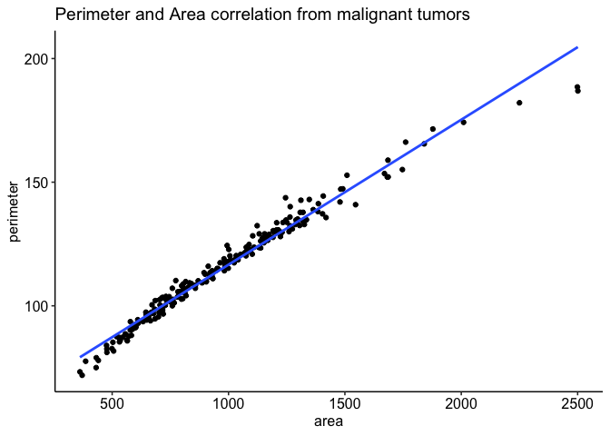
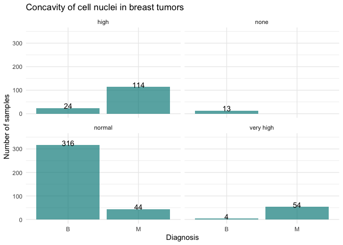
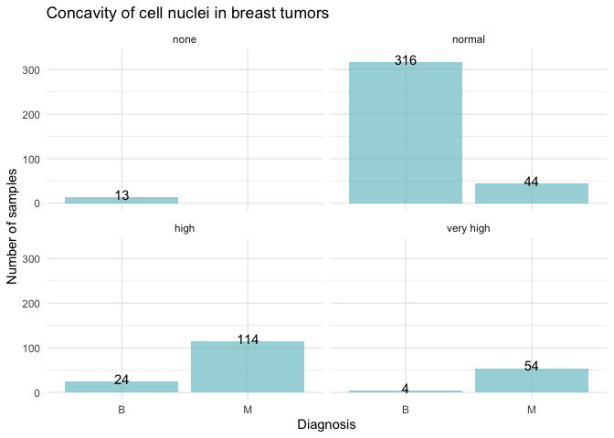
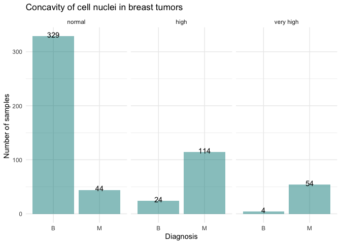
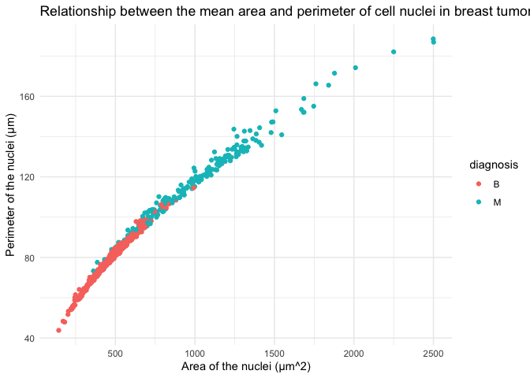

Mini Data Analysis Milestone 2
================

*To complete this milestone, you can edit [this `.rmd`
file](https://raw.githubusercontent.com/UBC-STAT/stat545.stat.ubc.ca/master/content/mini-project/mini-project-2.Rmd)
directly. Fill in the sections that are commented out with
`<!--- start your work here--->`. When you are done, make sure to knit
to an `.md` file by changing the output in the YAML header to
`github_document`, before submitting a tagged release on canvas.*

# Welcome to your second (and last) milestone in your mini data analysis project!

In Milestone 1, you explored your data, came up with research questions,
and obtained some results by making summary tables and graphs. This
time, we will first explore more in depth the concept of *tidy data.*
Then, you’ll be sharpening some of the results you obtained from your
previous milestone by:

-   Manipulating special data types in R: factors and/or dates and
    times.
-   Fitting a model object to your data, and extract a result.
-   Reading and writing data as separate files.

**NOTE**: The main purpose of the mini data analysis is to integrate
what you learn in class in an analysis. Although each milestone provides
a framework for you to conduct your analysis, it’s possible that you
might find the instructions too rigid for your data set. If this is the
case, you may deviate from the instructions – just make sure you’re
demonstrating a wide range of tools and techniques taught in this class.

# Instructions

**To complete this milestone**, edit [this very `.Rmd`
file](https://raw.githubusercontent.com/UBC-STAT/stat545.stat.ubc.ca/master/content/mini-project/mini-project-2.Rmd)
directly. Fill in the sections that are tagged with
`<!--- start your work here--->`.

**To submit this milestone**, make sure to knit this `.Rmd` file to an
`.md` file by changing the YAML output settings from
`output: html_document` to `output: github_document`. Commit and push
all of your work to your mini-analysis GitHub repository, and tag a
release on GitHub. Then, submit a link to your tagged release on canvas.

**Points**: This milestone is worth 55 points (compared to the 45 points
of the Milestone 1): 45 for your analysis, and 10 for your entire
mini-analysis GitHub repository. Details follow.

**Research Questions**: In Milestone 1, you chose two research questions
to focus on. Wherever realistic, your work in this milestone should
relate to these research questions whenever we ask for justification
behind your work. In the case that some tasks in this milestone don’t
align well with one of your research questions, feel free to discuss
your results in the context of a different research question.

# Learning Objectives

By the end of this milestone, you should:

-   Understand what *tidy* data is, and how to create it using `tidyr`.
-   Generate a reproducible and clear report using R Markdown.
-   Manipulating special data types in R: factors and/or dates and
    times.
-   Fitting a model object to your data, and extract a result.
-   Reading and writing data as separate files.

# Setup

Begin by loading your data and the tidyverse package below:

``` r
library(datateachr) # <- might contain the data you picked!
library(tidyverse)
library(ggplot2)
library(ggpubr)
library(forcats)
library(broom)
library(here)
library(cowplot)
library(ggpubr)
theme_set(theme_pubr())
```

# Task 1: Tidy your data (15 points)

In this task, we will do several exercises to reshape our data. The goal
here is to understand how to do this reshaping with the `tidyr` package.

A reminder of the definition of *tidy* data:

-   Each row is an **observation**
-   Each column is a **variable**
-   Each cell is a **value**

*Tidy’ing* data is sometimes necessary because it can simplify
computation. Other times it can be nice to organize data so that it can
be easier to understand when read manually.

### 2.1 (2.5 points)

Based on the definition above, can you identify if your data is tidy or
untidy? Go through all your columns, or if you have \>8 variables, just
pick 8, and explain whether the data is untidy or tidy.

<!--------------------------- Start your work below --------------------------->

In this milestone, the data from **cancer_samples** will be analyzed
more in depth, trying to use different tools to answer the questions
proposed. As stated in the previous milestone, the data contained in
this set are variables that describe characteristics of the cell nuclei
in tumors (both benign and malign).

``` r
#From this data set, we can see that it is tidy as every column is  a variable describing different nucleus characteristics, and every row is a unique observation for a unique sample that has its own identifier in the ID column. Variables are either numeric or character-defined but they are not mixed. 
#8 columns from the cancer_sample file were chosen to create a new tibble from it and prove that the data is tidy
tidy_cancer_data<-cancer_sample%>%
select(diagnosis, radius_mean, texture_mean, perimeter_mean, area_mean, smoothness_mean, symmetry_mean, concavity_mean)
tidy_cancer_data
```

    ## # A tibble: 569 × 8
    ##    diagnosis radius_mean texture_mean perimete…¹ area_…² smoot…³ symme…⁴ conca…⁵
    ##    <chr>           <dbl>        <dbl>      <dbl>   <dbl>   <dbl>   <dbl>   <dbl>
    ##  1 M                18.0         10.4      123.    1001   0.118    0.242  0.300 
    ##  2 M                20.6         17.8      133.    1326   0.0847   0.181  0.0869
    ##  3 M                19.7         21.2      130     1203   0.110    0.207  0.197 
    ##  4 M                11.4         20.4       77.6    386.  0.142    0.260  0.241 
    ##  5 M                20.3         14.3      135.    1297   0.100    0.181  0.198 
    ##  6 M                12.4         15.7       82.6    477.  0.128    0.209  0.158 
    ##  7 M                18.2         20.0      120.    1040   0.0946   0.179  0.113 
    ##  8 M                13.7         20.8       90.2    578.  0.119    0.220  0.0937
    ##  9 M                13           21.8       87.5    520.  0.127    0.235  0.186 
    ## 10 M                12.5         24.0       84.0    476.  0.119    0.203  0.227 
    ## # … with 559 more rows, and abbreviated variable names ¹​perimeter_mean,
    ## #   ²​area_mean, ³​smoothness_mean, ⁴​symmetry_mean, ⁵​concavity_mean

``` r
#To demonstrate all observations withing the selected variables are numerical, we did some stat analysis on them
Cancer_tidy_stats<- cancer_sample %>%
  group_by(diagnosis) %>%
  summarise(Mean_radius= mean(radius_mean), 
            Mean_texture= mean(texture_mean), 
            Mean_perimeter = mean(perimeter_mean),
            Mean_area= mean(area_mean),
            Mean_smoothness= mean(smoothness_mean), 
            Mean_symmetry= mean(symmetry_mean), 
            Mean_concavity= mean(concavity_mean))
Cancer_tidy_stats
```

    ## # A tibble: 2 × 8
    ##   diagnosis Mean_radius Mean_texture Mean_peri…¹ Mean_…² Mean_…³ Mean_…⁴ Mean_…⁵
    ##   <chr>           <dbl>        <dbl>       <dbl>   <dbl>   <dbl>   <dbl>   <dbl>
    ## 1 B                12.1         17.9        78.1    463.  0.0925   0.174  0.0461
    ## 2 M                17.5         21.6       115.     978.  0.103    0.193  0.161 
    ## # … with abbreviated variable names ¹​Mean_perimeter, ²​Mean_area,
    ## #   ³​Mean_smoothness, ⁴​Mean_symmetry, ⁵​Mean_concavity

<!----------------------------------------------------------------------------->

### 2.2 (5 points)

Now, if your data is tidy, untidy it! Then, tidy it back to it’s
original state.

If your data is untidy, then tidy it! Then, untidy it back to it’s
original state.

Be sure to explain your reasoning for this task. Show us the “before”
and “after”.

<!--------------------------- Start your work below --------------------------->

My data was tidy from the beginning, therefore, in the following lines I
untidied it and then wen back to its original state.

``` r
# To untidy the data, we will use the functions pivot_longer and pivot_wider.
#Pivot_longer: increases the number of rows while decreasing the number of columns. Therefore, the columns will be transposed to rows. In order to keep the data untidy, the ID column will not be transposed.·
#Pivot_wider: inversely to pivot_longer, this function increases the number of columns while decreasing the number of rows.
Cancer_untidy<-tidy_cancer_data%>%
  pivot_longer(cols= -diagnosis, names_to= "Variables")%>%
  pivot_wider(names_from=diagnosis, values_from=value)
```

    ## Warning: Values from `value` are not uniquely identified; output will contain list-cols.
    ## * Use `values_fn = list` to suppress this warning.
    ## * Use `values_fn = {summary_fun}` to summarise duplicates.
    ## * Use the following dplyr code to identify duplicates.
    ##   {data} %>%
    ##     dplyr::group_by(Variables, diagnosis) %>%
    ##     dplyr::summarise(n = dplyr::n(), .groups = "drop") %>%
    ##     dplyr::filter(n > 1L)

``` r
Cancer_untidy
```

    ## # A tibble: 7 × 3
    ##   Variables       M           B          
    ##   <chr>           <list>      <list>     
    ## 1 radius_mean     <dbl [212]> <dbl [357]>
    ## 2 texture_mean    <dbl [212]> <dbl [357]>
    ## 3 perimeter_mean  <dbl [212]> <dbl [357]>
    ## 4 area_mean       <dbl [212]> <dbl [357]>
    ## 5 smoothness_mean <dbl [212]> <dbl [357]>
    ## 6 symmetry_mean   <dbl [212]> <dbl [357]>
    ## 7 concavity_mean  <dbl [212]> <dbl [357]>

``` r
#We can now see the stats from the untidied data:
Cancer_untidy_stats<- Cancer_tidy_stats %>%
               pivot_longer(cols = -diagnosis, names_to = "Variables") %>% 
               pivot_wider(names_from = diagnosis, values_from = value)
Cancer_untidy_stats
```

    ## # A tibble: 7 × 3
    ##   Variables              B       M
    ##   <chr>              <dbl>   <dbl>
    ## 1 Mean_radius      12.1     17.5  
    ## 2 Mean_texture     17.9     21.6  
    ## 3 Mean_perimeter   78.1    115.   
    ## 4 Mean_area       463.     978.   
    ## 5 Mean_smoothness   0.0925   0.103
    ## 6 Mean_symmetry     0.174    0.193
    ## 7 Mean_concavity    0.0461   0.161

``` r
#Tidying data again:
#To do this, all variables will become rows again (except from diagnosis) and arranged as observations. Whereas the names in the Variables column will become headers again. The values are incorporated from the numerical observations.
Cancer_retidy <- Cancer_untidy_stats %>%
  pivot_longer(cols = c(-Variables), names_to = "Diagnosis") %>% 
      pivot_wider(names_from = Variables, values_from = value)
Cancer_retidy
```

    ## # A tibble: 2 × 8
    ##   Diagnosis Mean_radius Mean_texture Mean_peri…¹ Mean_…² Mean_…³ Mean_…⁴ Mean_…⁵
    ##   <chr>           <dbl>        <dbl>       <dbl>   <dbl>   <dbl>   <dbl>   <dbl>
    ## 1 B                12.1         17.9        78.1    463.  0.0925   0.174  0.0461
    ## 2 M                17.5         21.6       115.     978.  0.103    0.193  0.161 
    ## # … with abbreviated variable names ¹​Mean_perimeter, ²​Mean_area,
    ## #   ³​Mean_smoothness, ⁴​Mean_symmetry, ⁵​Mean_concavity

<!----------------------------------------------------------------------------->

### 2.3 (7.5 points)

Now, you should be more familiar with your data, and also have made
progress in answering your research questions. Based on your interest,
and your analyses, pick 2 of the 4 research questions to continue your
analysis in the next four tasks:

<!-------------------------- Start your work below ---------------------------->

1.  *Is there a correlation between the malignancy of a tumor and its
    concavity?*
2.  *Does the perimeter of the nuclei correlate with the area in malign
    tumors?*

<!----------------------------------------------------------------------------->

Explain your decision for choosing the above two research questions.

<!--------------------------- Start your work below --------------------------->

The cancer_sample data set does not have many character based variables,
most are numeric, which limit this area of the analysis. But the
diagnosis (the only character-based variable) is very important in our
data set. I though that I should use the numerical variables to try to
predict the outcome of our character-based variable, the diagnosis.
Therefore, I decided to work with the concavity as it is a variable I
had not worked a lot with and just out of curiosity since I could not
imagine how this variable could influence the biological activity of the
cell. Through a brief investigation, I discovered this variable is
important to determine characteristics such as migration which can be
related to metastasis in malignant cells.

On the other hand, the second question tries to find the relation
between two numeric values which, ideally, should be correlated by a
linear model but we wanted to probe this. In order to make it more
specific, I filtered the list of samples to just the malignant ones. In
the case we find that the perimeter and area are not related, we could
maybe attribute it to the way this data was obtained (computational
analysis).

<!----------------------------------------------------------------------------->

Now, try to choose a version of your data that you think will be
appropriate to answer these 2 questions. Use between 4 and 8 functions
that we’ve covered so far (i.e. by filtering, cleaning, tidy’ing,
dropping irrelevant columns, etc.).

<!--------------------------- Start your work below --------------------------->

``` r
#The concavity variable was changed to allow for easier access to it as well as ordering its observations. Firstly, the variable was renamed and the diagnosis and concavity variables were selected to store in this new data set. Furthermore, the observations in the variable were ordered in an ascending order, and after ordering by diagnosis, the mean was obtained. To obtained more detailed information,mutate was used to round up to 5 decimals

concavity_modified <- cancer_sample %>%
  rename(c("concavity"="concavity_mean"))%>%
  select(diagnosis, concavity) %>%
  arrange(concavity)  %>%
  group_by(diagnosis)%>%
  summarise(Mean_concavity = mean(concavity)) %>%
  mutate(across(where(is.numeric), ~ round(., 5)))
concavity_modified
```

    ## # A tibble: 2 × 2
    ##   diagnosis Mean_concavity
    ##   <chr>              <dbl>
    ## 1 B                 0.0461
    ## 2 M                 0.161

``` r
#Again, the variables that were going to be worked on the second question were grouped and renamed by selecting them and ignoring the irrelevant variables. The observations were ordered in ascending order according to their area and filtered by malignancy. Finally, a scatter plot showing the regression line was created between these two variables.
area_per_modified<- cancer_sample %>%
  rename(c("area"="area_mean", "perimeter"="perimeter_mean")) %>%
  select(diagnosis, area, perimeter) %>%
  arrange(area)%>%
  filter(diagnosis == "M")%>%
  ggplot(aes(area, perimeter)) + 
  geom_point()+
  labs(title="Perimeter and Area correlation from malignant tumors") +
  geom_smooth(method = "lm", se=FALSE)
area_per_modified
```

    ## `geom_smooth()` using formula 'y ~ x'

<!-- -->
<!----------------------------------------------------------------------------->

# Task 2: Special Data Types (10)

For this exercise, you’ll be choosing two of the three tasks below –
both tasks that you choose are worth 5 points each.

But first, tasks 1 and 2 below ask you to modify a plot you made in a
previous milestone. The plot you choose should involve plotting across
at least three groups (whether by faceting, or using an aesthetic like
color). Place this plot below (you’re allowed to modify the plot if
you’d like). If you don’t have such a plot, you’ll need to make one.
Place the code for your plot below.
<!-------------------------- Start your work below ---------------------------->
The graph I chose for this assignment was the concavity_modified tibble
from last exercise (line 151)
<!----------------------------------------------------------------------------->

<!-------------------------- Start your work below ---------------------------->

Question: *Is there a correlation between the malignancy of a tumor and
its concavity?*

Task Number 1. Produce a new plot that reorders a factor in your
original plot, using the `forcats` package (3 points). Then, in a
sentence or two, briefly explain why you chose this ordering (1 point
here for demonstrating understanding of the reordering, and 1 point for
demonstrating some justification for the reordering, which could be
subtle or speculative.)

#Reordering

Task Number 1. Produce a new plot that reorders a factor in your
original plot, using the `forcats` package (3 points). Then, in a
sentence or two, briefly explain why you chose this ordering (1 point
here for demonstrating understanding of the reordering, and 1 point for
demonstrating some justification for the reordering, which could be
subtle or speculative.)

##Explanation:

The concavity of the cell nuclei gives a measurement of the portions of
the contour of the nuclei that have this shape. The more spherical a
cell is, the least concavity it had. Normal cells tend to have a
spherical or oblong nucleus. Therefore, it is expected for their
concavity level to be null. Whereas malignant cells have higher
concavity values closer to 1.

The observations and levels were reordered so that the concavity will be
shown from lowest to highest. This will help visualize the data patterns
and behavior more easily. The groups were also separated by malign and
benign to detect if the changes in concavity correspond to the diagnosis
group as well.

``` r
#I separated the concavity modified tibble in order to manipulate the data in a better way
concavity <- cancer_sample %>%
  rename(c("concavity_value"="concavity_mean"))%>%
  select(diagnosis, concavity_value) %>%
  arrange(concavity_value)

concavity_stat1 <- concavity %>%
  group_by(diagnosis)%>%
  summarise(Mean_concavity = mean(concavity_value)) %>%
  mutate(across(where(is.numeric), ~ round(., 3)))
concavity_stat1
```

    ## # A tibble: 2 × 2
    ##   diagnosis Mean_concavity
    ##   <chr>              <dbl>
    ## 1 B                  0.046
    ## 2 M                  0.161

``` r
#A tibble that divided the concavity values into levels was created. This levels for concavity were labeled as: none(likely benign), normal, high, and very high (likely malignant), according to their numerical values.
concavity_char<-concavity  %>%
     mutate(concavity_level = case_when (concavity_value ==0 ~  "none", 
                                   concavity_value <0.1 ~  "normal", 
                                   concavity_value <0.2 ~  "high", 
                                   TRUE ~ "very high"))
concavity_char
```

    ## # A tibble: 569 × 3
    ##    diagnosis concavity_value concavity_level
    ##    <chr>               <dbl> <chr>          
    ##  1 B                       0 none           
    ##  2 B                       0 none           
    ##  3 B                       0 none           
    ##  4 B                       0 none           
    ##  5 B                       0 none           
    ##  6 B                       0 none           
    ##  7 B                       0 none           
    ##  8 B                       0 none           
    ##  9 B                       0 none           
    ## 10 B                       0 none           
    ## # … with 559 more rows

``` r
#A graph that divided the samples between malignant and non-malignant while also keeping track of concavity levels. Count was used to show the number of samples that fit in each category in the y axis, instead of their frequencies.The y maximum value was set to 350 and labels of each category were printed on top of each graph group. Also the fill and position were changed.
conc_level_graph <- ggplot(concavity_char, aes(diagnosis, ..count..)) +
   labs(title="Concavity of cell nuclei in breast tumors", y ="Number of samples ", x = "Diagnosis") +
   geom_bar(fill= "darkcyan", alpha = 0.7, position = "dodge") +
   ylim(0, 350) +
   facet_wrap(~ concavity_level) +
   geom_text(aes(label = ..count..), stat = "count", vjust = 0.1) +
   theme_minimal()
print(conc_level_graph)
```

<!-- -->

``` r
#Observations were reordered so that they appear in ascending concavity order instead of alphabetically.Fct-inorder was used to reorder factor levels as described previously.This was ploted to produce a similar but reordered graph from the one above.
conc_level_graph2 <- concavity_char %>%
mutate(concavity_level= fct_inorder(concavity_level)) %>%
ggplot(aes(diagnosis, ..count..)) +
  labs(title="Concavity of cell nuclei in breast tumors", y ="Number of samples ", x = "Diagnosis") +
   geom_bar(fill= "cadetblue3", alpha = 0.7, position = "dodge") +
   ylim(0, 330) +
   facet_wrap(~ concavity_level) +
   geom_text(aes(label = ..count..), stat = "count", vjust = 0.2) +
     theme_minimal() 
print(conc_level_graph2)
```

<!-- -->
*Analysis* The results shown in the graph are interesting as most tumors
in the high and very high category are malignant, as expected. However,
there was a relatively high incidence of benign tumors with high and
even some showed very high concavity levels. This tells us that
concavity alone might not be the best measure to try and diagnose a
patient.
<!----------------------------------------------------------------------------->

<!-------------------------- Start your work below ---------------------------->

Task Number 2. Produce a new plot that groups some factor levels
together into an “other” category (or something similar), using the
`forcats` package (3 points). Then, in a sentence or two, briefly
explain why you chose this grouping (1 point here for demonstrating
understanding of the grouping, and 1 point for demonstrating some
justification for the grouping, which could be subtle or speculative.)

## Grouping “none” and “normal”

The “None” category has negligible values and as we are mostly
interested in normal, high and very high categories, I thought about
deleting this category. The tumors in this category might also fall down
the benign spectrum although I did consider it intriguing its lack in
concavity which could be a sign of other condition. To keep things
simple, the zero and normal populations will me merged.

``` r
#The fct_collapse was used to group some of the levels created previously together.
conc_collapse <- concavity_char %>%
mutate(concavity_level = fct_collapse(concavity_level, normal =c("none","normal"))) %>%
mutate(concavity_level= fct_inorder(concavity_level))
print(conc_collapse)
```

    ## # A tibble: 569 × 3
    ##    diagnosis concavity_value concavity_level
    ##    <chr>               <dbl> <fct>          
    ##  1 B                       0 normal         
    ##  2 B                       0 normal         
    ##  3 B                       0 normal         
    ##  4 B                       0 normal         
    ##  5 B                       0 normal         
    ##  6 B                       0 normal         
    ##  7 B                       0 normal         
    ##  8 B                       0 normal         
    ##  9 B                       0 normal         
    ## 10 B                       0 normal         
    ## # … with 559 more rows

``` r
#The graph from the collapsed data above was created showing only three levels only (normal, high, very high)
conc_collapse_graph <- conc_collapse %>%
ggplot(aes(diagnosis, ..count..)) +
   labs(title="Concavity of cell nuclei in breast tumors", y ="Number of samples ", x = "Diagnosis") +
   geom_bar(fill= "darkcyan", alpha = 0.5, position = "dodge") +
   facet_wrap(~ concavity_level) +
   geom_text(aes(label = ..count..), stat = "count", vjust = 0.2) +
    theme_minimal() 
print(conc_collapse_graph)
```

<!-- -->
Grouping the zero and normal category makes sense because zero belongs
to the normal category as well as cells with a low concavity (less than
0.1). In this new plot, the three categories are organized horizontally,
making it easier to see that there are more samples in the normal
category and that malign tumors have a more significant representation
in the high and very high categories, which means that malign tumors
tend to have more aberrant nuclei shape with more severe concavity
portions.
<!----------------------------------------------------------------------------->

# Task 3: Modelling

## 2.0 (no points)

Pick a research question, and pick a variable of interest (we’ll call it
“Y”) that’s relevant to the research question. Indicate these.

<!-------------------------- Start your work below ---------------------------->

**Research Question**: *Does the perimeter of the nuclei correlate with
the area in malign tumors?*

**Variable of interest**: *perimeter_mean*

<!----------------------------------------------------------------------------->

## 2.1 (5 points)

Fit a model or run a hypothesis test that provides insight on this
variable with respect to the research question. Store the model object
as a variable, and print its output to screen. We’ll omit having to
justify your choice, because we don’t expect you to know about model
specifics in STAT 545.

-   **Note**: It’s OK if you don’t know how these models/tests work.
    Here are some examples of things you can do here, but the sky’s the
    limit.

    -   You could fit a model that makes predictions on Y using another
        variable, by using the `lm()` function.
    -   You could test whether the mean of Y equals 0 using `t.test()`,
        or maybe the mean across two groups are different using
        `t.test()`, or maybe the mean across multiple groups are
        different using `anova()` (you may have to pivot your data for
        the latter two).
    -   You could use `lm()` to test for significance of regression.

## 2.2 (5 points)

Produce something relevant from your fitted model: either predictions on
Y, or a single value like a regression coefficient or a p-value.

-   Be sure to indicate in writing what you chose to produce.
-   Your code should either output a tibble (in which case you should
    indicate the column that contains the thing you’re looking for), or
    the thing you’re looking for itself.
-   Obtain your results using the `broom` package if possible. If your
    model is not compatible with the broom function you’re needing, then
    you can obtain your results by some other means, but first indicate
    which broom function is not compatible.

<!-------------------------- Start your work below ---------------------------->

The above tasks were done in the following lines (2.1-fitted linear
model and 2.2-predictions on the dependent variable using the broom
package).

``` r
#A scatter plot was created to explore the relationship between the mean area and perimeter of the samples' nuclei. Geom_point aesthetics was used to differentiate the points by color based on their diagnosis group (M or B).

area_per_graph1<- cancer_sample %>%
  ggplot(aes(area_mean, perimeter_mean)) + 
  labs(title="Relationship between the mean area and perimeter of cell nuclei in breast tumors", y ="Perimeter of the nuclei (µm)", x = "Area of the nuclei (µm^2)") +
  geom_point(aes(colour=diagnosis)) +
   theme_minimal()
area_per_graph1
```

<!-- -->

``` r
#A tibble was created to simplify the way to access the data I was interested in (perimeter and area mean). These observations were arranged in ascending order according to their area values, and only malign tumors were taken into account.
area_per_data<- cancer_sample %>%
  rename(c("area"="area_mean", "perimeter"="perimeter_mean")) %>%
  select(diagnosis, area, perimeter) %>%
  arrange(area)%>%
  filter(diagnosis == "M")
area_per_data
```

    ## # A tibble: 212 × 3
    ##    diagnosis  area perimeter
    ##    <chr>     <dbl>     <dbl>
    ##  1 M          362.      73.3
    ##  2 M          371.      71.9
    ##  3 M          386.      77.6
    ##  4 M          431.      75  
    ##  5 M          432       79.0
    ##  6 M          441.      77.9
    ##  7 M          476.      84.0
    ##  8 M          477.      82.6
    ##  9 M          477.      81.2
    ## 10 M          499       82.7
    ## # … with 202 more rows

``` r
#To have a better idea of the linear relationship between these two variables, we used the linear model function.
area_per_model <- lm(perimeter ~ area, area_per_data)
print(area_per_model)
```

    ## 
    ## Call:
    ## lm(formula = perimeter ~ area, data = area_per_data)
    ## 
    ## Coefficients:
    ## (Intercept)         area  
    ##    57.99464      0.05864

``` r
#Glance function was used to validate the model. This function returns one row summary (fit measurement, p-values, tests on residuals) of the model created. 
area_per_model_data <-glance(area_per_model)
area_per_model_data
```

    ## # A tibble: 1 × 12
    ##   r.squared adj.r.squ…¹ sigma stati…²   p.value    df logLik   AIC   BIC devia…³
    ##       <dbl>       <dbl> <dbl>   <dbl>     <dbl> <dbl>  <dbl> <dbl> <dbl>   <dbl>
    ## 1     0.975       0.974  3.49   8061. 1.73e-169     1  -565. 1136. 1146.   2559.
    ## # … with 2 more variables: df.residual <int>, nobs <int>, and abbreviated
    ## #   variable names ¹​adj.r.squared, ²​statistic, ³​deviance

``` r
#The r squared and p value obtained above looked promising for the linear model.Therefore, I tested its capacity to make predictions with said model. The augment function creates dependent variable predictions using the model and residuals.
areaper_model_data_aug <-augment(area_per_model)
areaper_model_data_aug
```

    ## # A tibble: 212 × 8
    ##    perimeter  area .fitted .resid   .hat .sigma .cooksd .std.resid
    ##        <dbl> <dbl>   <dbl>  <dbl>  <dbl>  <dbl>   <dbl>      <dbl>
    ##  1      73.3  362.    79.2  -5.90 0.0180   3.47 0.0267      -1.71 
    ##  2      71.9  371.    79.8  -7.86 0.0176   3.46 0.0463      -2.27 
    ##  3      77.6  386.    80.6  -3.06 0.0170   3.49 0.00674     -0.883
    ##  4      75    431.    83.3  -8.27 0.0152   3.45 0.0440      -2.39 
    ##  5      79.0  432     83.3  -4.34 0.0152   3.49 0.0121      -1.25 
    ##  6      77.9  441.    83.8  -5.90 0.0148   3.47 0.0218      -1.70 
    ##  7      84.0  476.    85.9  -1.93 0.0136   3.50 0.00213     -0.557
    ##  8      82.6  477.    86.0  -3.40 0.0135   3.49 0.00659     -0.981
    ##  9      81.2  477.    86.0  -4.84 0.0135   3.48 0.0133      -1.40 
    ## 10      82.7  499     87.3  -4.57 0.0128   3.48 0.0112      -1.32 
    ## # … with 202 more rows

``` r
#I repeated the process but this time taking into account only the benign samples. As the model has to have the same number of observations, only samples up to 212 were selected. The dependent and independent variables were kept the same (perimeter and area respectively).
benign_data<- cancer_sample %>%
  rename(c("area"="area_mean", "perimeter"="perimeter_mean")) %>%
  select(diagnosis, area, perimeter) %>%
  arrange(area)%>%
  filter(diagnosis == "B")%>%
  slice(1:212)

#Predictions for the benign samples were created, this time for the benign tumors. 
areaper_data_aug_be <-augment(area_per_model, benign_data)
areaper_data_aug_be
```

    ## # A tibble: 212 × 9
    ##    diagnosis  area perimeter .fitted .resid   .hat .sigma .cooksd .std.resid
    ##    <chr>     <dbl>     <dbl>   <dbl>  <dbl>  <dbl>  <dbl>   <dbl>      <dbl>
    ##  1 B          144.      43.8    79.2  -35.4 0.0180   3.47 0.0267      -1.71 
    ##  2 B          170.      48.3    79.8  -31.4 0.0176   3.46 0.0463      -2.27 
    ##  3 B          179.      48.0    80.6  -32.7 0.0170   3.49 0.00674     -0.883
    ##  4 B          181       47.9    83.3  -35.4 0.0152   3.45 0.0440      -2.39 
    ##  5 B          202.      51.7    83.3  -31.6 0.0152   3.49 0.0121      -1.25 
    ##  6 B          204.      53.3    83.8  -30.6 0.0148   3.47 0.0218      -1.70 
    ##  7 B          221.      54.1    85.9  -31.8 0.0136   3.50 0.00213     -0.557
    ##  8 B          221.      54.5    86.0  -31.4 0.0135   3.49 0.00659     -0.981
    ##  9 B          222.      54.7    86.0  -31.3 0.0135   3.48 0.0133      -1.40 
    ## 10 B          224.      54.3    87.3  -32.9 0.0128   3.48 0.0112      -1.32 
    ## # … with 202 more rows

<!----------------------------------------------------------------------------->

# Task 4: Reading and writing data

Get set up for this exercise by making a folder called `output` in the
top level of your project folder / repository. You’ll be saving things
there.

## 3.1 (5 points)

Take a summary table that you made from Milestone 1 (Task 4.2), and
write it as a csv file in your `output` folder. Use the `here::here()`
function.

-   **Robustness criteria**: You should be able to move your Mini
    Project repository / project folder to some other location on your
    computer, or move this very Rmd file to another location within your
    project repository / folder, and your code should still work.
-   **Reproducibility criteria**: You should be able to delete the csv
    file, and remake it simply by knitting this Rmd file.

<!-------------------------- Start your work below ---------------------------->

``` r
#Exercise taken from part 4 of the Milestone 1 (Process and Summarize your data). In summary, the variables that were used, were selected and mutate function helped me create a new character based variable that divided the area standard error in categories according to their value. Then this was transformed into a numerical value (1 for high and 0 for low). After this, the main statistical characteristics were summarized as seen below, and mutate function was used to round up the values. 
areavar_stat<-cancer_sample %>%
    select(ID, diagnosis, area_mean, area_se)%>%
    mutate(area_variability=case_when(area_se>50~'high',
                                      area_se<50~'low'))%>%
  mutate(areavar_num=case_when(area_variability=="high" ~1,
                                  area_variability=="low" ~0 ))%>%
  arrange(areavar_num)  %>%
  summarise(Mean_areavar = mean(areavar_num),
            SD_areavar = sd(areavar_num),
            Min_areavar = min(areavar_num),
            Median_areavar = median(areavar_num),
            Max_areavar = max(areavar_num), 
            n=n()) %>%
  mutate(across(where(is.numeric), ~ round(., 1)))
areavar_stat
```

    ## # A tibble: 1 × 6
    ##   Mean_areavar SD_areavar Min_areavar Median_areavar Max_areavar     n
    ##          <dbl>      <dbl>       <dbl>          <dbl>       <dbl> <dbl>
    ## 1          0.2        0.4           0              0           1   569

``` r
#The write_csv function was used to convert the tibble into a csv file that is comma-separated. The location (Output) and file name was included.
write_csv(areavar_stat, here("Output", "Area_variability_tumors_exported_file.csv"))
dir(here::here("Output")) #To know the location of the file
```

    ## [1] "area_linear_model.rds"                    
    ## [2] "Area_variability_tumors_exported_file.csv"

<!----------------------------------------------------------------------------->

## 3.2 (5 points)

Write your model object from Task 3 to an R binary file (an RDS), and
load it again. Be sure to save the binary file in your `output` folder.
Use the functions `saveRDS()` and `readRDS()`.

-   The same robustness and reproducibility criteria as in 3.1 apply
    here.

<!-------------------------- Start your work below ---------------------------->

``` r
#To use the saveRDS function, we need to specify the name of the file and the location where it will be saved. 
saveRDS(area_per_model, here("Output", "area_linear_model.rds"))
dir(here::here("Output"))
```

    ## [1] "area_linear_model.rds"                    
    ## [2] "Area_variability_tumors_exported_file.csv"

``` r
#Model is then loaded and saved into a new variable, and we specify the name of the file and the location where it will be stored.
read_area_linear_model <- readRDS(here("output", "area_linear_model.rds"))
read_area_linear_model
```

    ## 
    ## Call:
    ## lm(formula = perimeter ~ area, data = area_per_data)
    ## 
    ## Coefficients:
    ## (Intercept)         area  
    ##    57.99464      0.05864

<!----------------------------------------------------------------------------->

# Tidy Repository

Now that this is your last milestone, your entire project repository
should be organized. Here are the criteria we’re looking for.

## Main README (3 points)

There should be a file named `README.md` at the top level of your
repository. Its contents should automatically appear when you visit the
repository on GitHub.

Minimum contents of the README file:

-   In a sentence or two, explains what this repository is, so that
    future-you or someone else stumbling on your repository can be
    oriented to the repository.
-   In a sentence or two (or more??), briefly explains how to engage
    with the repository. You can assume the person reading knows the
    material from STAT 545A. Basically, if a visitor to your repository
    wants to explore your project, what should they know?

Once you get in the habit of making README files, and seeing more README
files in other projects, you’ll wonder how you ever got by without them!
They are tremendously helpful.

## File and Folder structure (3 points)

You should have at least four folders in the top level of your
repository: one for each milestone, and one output folder. If there are
any other folders, these are explained in the main README.

Each milestone document is contained in its respective folder, and
nowhere else.

Every level-1 folder (that is, the ones stored in the top level, like
“Milestone1” and “output”) has a `README` file, explaining in a sentence
or two what is in the folder, in plain language (it’s enough to say
something like “This folder contains the source for Milestone 1”).

## Output (2 points)

All output is recent and relevant:

-   All Rmd files have been `knit`ted to their output, and all data
    files saved from Task 4 above appear in the `output` folder.
-   All of these output files are up-to-date – that is, they haven’t
    fallen behind after the source (Rmd) files have been updated.
-   There should be no relic output files. For example, if you were
    knitting an Rmd to html, but then changed the output to be only a
    markdown file, then the html file is a relic and should be deleted.

Our recommendation: delete all output files, and re-knit each
milestone’s Rmd file, so that everything is up to date and relevant.

PS: there’s a way where you can run all project code using a single
command, instead of clicking “knit” three times. More on this in STAT
545B!

## Error-free code (1 point)

This Milestone 1 document knits error-free, and the Milestone 2 document
knits error-free.

## Tagged release (1 point)

You’ve tagged a release for Milestone 1, and you’ve tagged a release for
Milestone 2.

### Attribution

Thanks to Victor Yuan for mostly putting this together.
